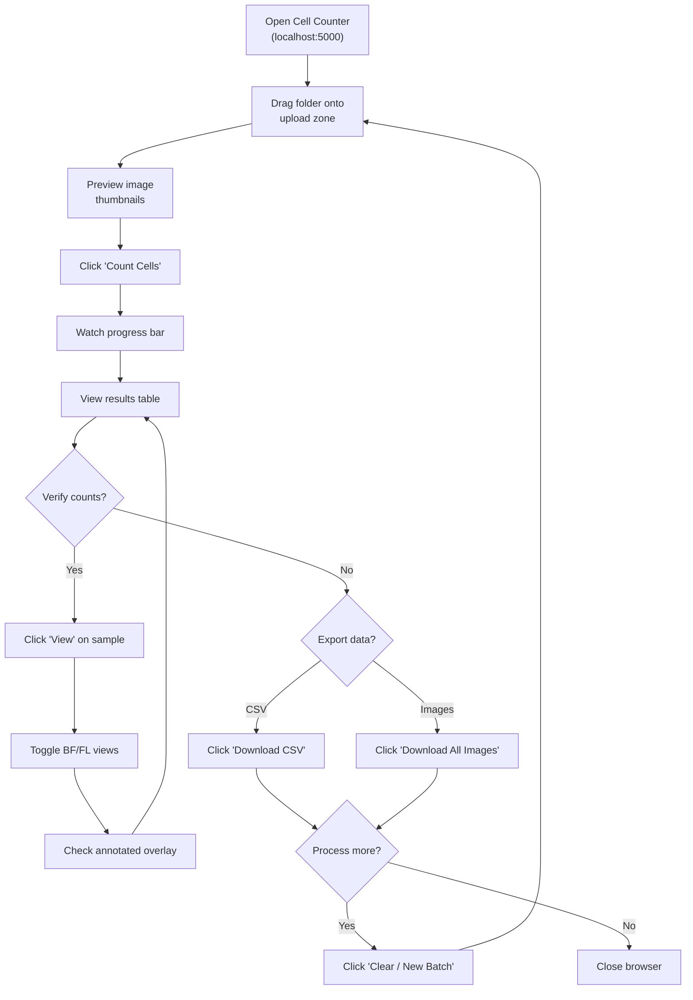
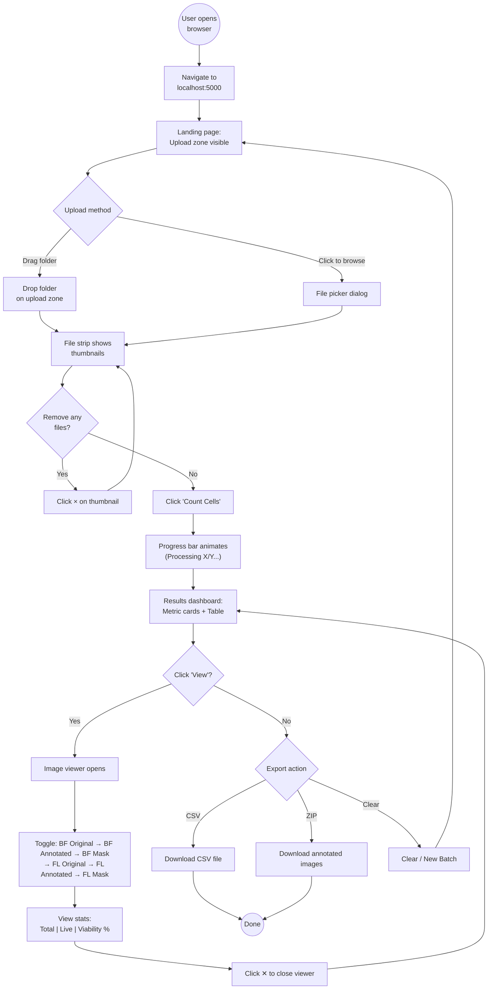

# Cell Counter — UX Redesign Project
## D5 · Design Artifacts
### Personas, Scenarios, Storyboard, Task & User Flows

**CEN 5728 · User Experience Design**
**University of Florida · Spring 2026**

**Student:** Vishnu Sai Padyala
**Interface:** Cell Counter Web Application (BlueberryLab UF)
**Platform:** Web (Desktop Browser) — localhost:5000

---

## Affinity Diagram — Themes from "Walking the Data"

After conducting all 4 interviews, responses were transcribed and organized into sticky notes, grouped by similarity into clusters, and labeled with higher-level themes.

### Group 1 — Speed & Efficiency
- Technicians want batch processing: drop a folder, click once, get all results
- Manual counting takes 3-4 hours for 20 samples — unacceptable during time-sensitive fermentation
- ImageJ requires 8-10 minutes per image with manual threshold adjustment
- Technicians want results within 30 minutes of sampling, not 4 hours later

### Group 2 — Accuracy & Trust
- Operator variability: 10-20% systematic difference between technicians on the same sample
- Boundary rule confusion on hemocytometer causes inconsistent counts
- Technicians need visual verification (annotated images) to trust automated results
- PI wants to spot-check annotated images to resolve data trust issues

### Group 3 — Tool Complexity & Learning Curve
- ImageJ is "intimidating" and "too complicated" for lab technicians
- Threshold values vary per image, even within the same batch
- New technicians require 2-3 days of training on manual counting protocols
- Ideal tool should require zero training — usable on day one

### Group 4 — Data Management & Export
- Results scattered across lab notebooks, Excel sheets, and ImageJ CSV exports
- Column headers and formats differ between operators
- Copy-paste errors and formula drift in Excel are common
- PI wants a single, standardized CSV with all metrics in one file

### Group 5 — Viability Assessment
- Live/dead counting doubles the total workflow time
- Trypan Blue color judgment is subjective — "is it light blue or clear?"
- Viability data arrives separately from total counts, delaying decisions
- Technicians want total count + live count + viability % in one unified output

### Group 6 — Workflow Fragmentation
- Current workflow spans 4+ separate tools with no integration
- Separate protocols for bright-field vs. fluorescence counting
- No connection between image capture and data recording
- Technicians want a single interface for the entire pipeline

---

## List of User Needs

1. Users need to upload and process large batches of microscope images in a single action
2. Users need automatic detection and counting of cells without manual parameter tuning
3. Users need visual verification of counts through annotated image overlays
4. Users need automatic pairing of bright-field and fluorescence images by sample ID
5. Users need unified viability calculation (total + live + %) in one results table
6. Users need clean, standardized CSV export with zero manual data entry
7. Users need a zero-training interface that can be operated on the first day
8. Users need consistent, operator-independent results to eliminate human variability

---

## Personas

### Primary Persona — Maria Santos (Senior Lab Technician)

| Attribute | Detail |
|-----------|--------|
| **Name** | Maria Santos |
| **Age** | 28 |
| **Role** | Senior Lab Technician, BlueberryLab UF |
| **Experience** | 4 years in the fermentation lab |
| **Education** | B.S. Biology |
| **Tech Comfort** | Moderate — comfortable with Excel, avoids complex software |

**Bio:** Maria is the backbone of the daily lab operations. She processes 15-25 cell counting samples every day during active fermentation runs. She is meticulous but time-pressured, often working against fermentation deadlines where pitch rate decisions must be made within 30 minutes of sampling.

**Goals:**
- Complete all daily counts within 1 hour instead of 3-4 hours
- Eliminate manual arithmetic errors that have caused data quality issues
- Train new technicians quickly without multi-day onboarding

**Frustrations:**
- Loses count mid-quadrant when interrupted (happens 3-4 times daily)
- Has caught herself entering wrong dilution factors in Excel
- Viability counting with Trypan Blue doubles her workload

**Quote:** *"I just want to drag a folder in, press one button, and get a CSV with all my counts. I don't want to touch any settings."*

---

### Secondary Persona 1 — James Park (Graduate Researcher)

| Attribute | Detail |
|-----------|--------|
| **Name** | James Park |
| **Age** | 24 |
| **Role** | M.S. Student, Fermentation Kinetics Research |
| **Experience** | 2 years, counts cells 2-3× per week |
| **Education** | B.S. Biomedical Engineering |
| **Tech Comfort** | High — has used ImageJ, Python, MATLAB |

**Bio:** James is a technically proficient researcher who tried to automate counting with ImageJ but was defeated by inconsistent threshold requirements across images. He values accuracy over speed and wants to see debug outputs and processing details.

**Goals:**
- Achieve consistent, reproducible counts across all images in a batch
- Eliminate the per-image threshold tuning that consumes 80% of his ImageJ time
- Get both bright-field and fluorescence results in a single unified output

**Frustrations:**
- ImageJ threshold varies per image even in the same batch
- Watershed algorithm splits single cells into fragments
- Lost entire analysis sessions due to accidental window closures

**Quote:** *"I just want something that automatically knows the difference between bright-field and fluorescence and processes them correctly without me configuring anything."*

---

### Secondary Persona 2 — Dr. Wei Chen (Lab Manager / PI)

| Attribute | Detail |
|-----------|--------|
| **Name** | Dr. Wei Chen |
| **Age** | 42 |
| **Role** | Principal Investigator, Fermentation Lab |
| **Experience** | 12 years leading the lab |
| **Education** | Ph.D. Microbiology |
| **Tech Comfort** | Low for tools — reviews data in Excel and publications |

**Bio:** Dr. Chen does not count cells himself but makes critical process decisions based on the data his technicians submit. His primary concern is data consistency and trust — he needs to be confident that the numbers are accurate regardless of which technician generated them.

**Goals:**
- Receive consistent data regardless of which operator counted
- Get total count + viability in a single standardized report
- Spot-check annotated images to build trust in automated results

**Frustrations:**
- 10% systematic difference between operators on the same samples
- Data format varies depending on who filled out the spreadsheet
- Viability data arrives as a separate spreadsheet, delaying decisions

**Quote:** *"I want one system that all my technicians use, so I get consistent data regardless of who is operating it."*

---

## Scenarios

### Scenario 1 — Daily Use Scenario
**Design challenge:** An interface to support lab technicians processing daily fermentation monitoring samples quickly and accurately.

**User needs addressed:**
1. Upload and process large batches in a single action
2. Automatic counting without parameter tuning
3. Visual verification through annotated overlays
4. Automatic bright-field / fluorescence pairing
5. Unified viability calculation
6. Clean CSV export

**Narrative:** Maria arrives at 9 AM with 21 fermentation samples already photographed on the microscope. Each sample has two images: one bright-field and one fluorescence. She opens the Cell Counter in her browser, drags the entire `New_Raw` folder onto the upload zone, and clicks "Count Cells." The progress bar fills over 2 minutes. When complete, she sees a results table showing each sample's Total Cells, Live Cells, and Viability %. She clicks "View" on sample 2_04, which shows 63.2% viability — lower than expected. She toggles to the annotated image to verify the count looks correct. Satisfied, she clicks "Download CSV" and attaches the file to her daily report email to Dr. Chen. The entire process took 4 minutes.

---

### Scenario 2 — Infrequent, Common Scenario
**Design challenge:** An interface that allows a PI to spot-check and verify automated counting results when data seems anomalous.

**User needs addressed:**
1. Visual verification of counts
2. Consistent, operator-independent results
3. Annotated image review

**Narrative:** Dr. Chen receives Maria's daily CSV at 9:15 AM. He notices sample 2_03 shows 100% viability (11 total, 11 live) while surrounding samples are at 30-65%. This is unusual. He opens the Cell Counter in his browser, navigates to the results from the current batch, and clicks "View" on sample 2_03. He toggles between the original bright-field image and the annotated overlay. He sees that the bright-field image had very poor contrast, causing the algorithm to detect fewer total cells — but the fluorescence image clearly showed 11 glowing live cells. The system automatically corrected the total count to match (since you cannot have more live cells than total cells). Dr. Chen understands the biological logic, notes the poor image quality in his records, and asks Maria to re-photograph that sample.

---

## Narrative Storyboard

### Panel 1 — The Problem
Maria arrives at the lab bench. The microscope camera has captured 42 images (21 samples × 2 image types) from yesterday's fermentation run. She opens her laptop and sighs — she knows this will take 3-4 hours of manual counting.

### Panel 2 — The Old Way
She loads the hemocytometer, peers through the eyepiece, and clicks her tally counter. Her phone buzzes — she loses count and has to restart the quadrant. She writes "87" in her notebook, then second-guesses herself. Was it 87 or 78?

### Panel 3 — Discovery
Her colleague James mentions the new Cell Counter web app. "You just drag a folder in," he says. Maria is skeptical but opens her browser to `localhost:5000`.

### Panel 4 — The New Way
She drags her entire `New_Raw` folder onto the upload zone. All 42 images appear as thumbnails. She clicks "Count Cells" and watches the progress bar fill. In 2 minutes, the results table appears with all 21 samples — each showing Total Cells, Live Cells, and Viability %.

### Panel 5 — Verification
Maria clicks "View" on a sample she knows well. She sees the original image on the left and the annotated image on the right — every detected cell circled in red. She toggles to the fluorescence view and sees green circles on glowing cells. The numbers match her expectations perfectly.

### Panel 6 — Resolution
Maria clicks "Download CSV" and the clean spreadsheet appears in her downloads folder. She emails it to Dr. Chen. It is 9:05 AM. She has the rest of the morning for actual science. She whispers, "Why didn't we have this 3 years ago?"

---

## Task Flow Diagram

---

## User Flow Diagram

---

## Brainstorming Session

The team conducted a 20-minute brainstorming session generating three design directions based on the design artifacts above. Three approaches were explored:

### Design A — "Minimal Dashboard"
A single-page app with just an upload box and a results table. No image viewer, no metric cards, no toggling. Inspired by Priya's request for maximum simplicity. Everything is one flat list.

**Pros:** Extremely simple, zero learning curve
**Cons:** No visual verification (critical for Dr. Chen's trust requirement), no viability breakdown

### Design B — "Scientific Workbench"
A multi-panel interface inspired by ImageJ, with a side panel for image manipulation, a central canvas, and a bottom panel for results. Includes manual threshold controls and advanced settings for power users like James.

**Pros:** Powerful, flexible, appealing to technical users
**Cons:** Violates Priya's "zero training" requirement, reintroduces the complexity problem

### Design C — "Progressive Disclosure Dashboard"
A single-page app that starts simple (upload zone only) and progressively reveals complexity: progress bar → metric cards → results table → image viewer (on click). Settings are hidden entirely — intelligent defaults handle everything. Visual verification is available but not mandatory.

**Pros:** Satisfies both Priya (simple start) and Dr. Chen (verification available), batch processing, unified bright-field/fluorescence workflow
**Cons:** Advanced users may want more control (addressed by future Active Learning canvas)

### Final Design Decision
**Design C was selected** as the final design direction. It combines the simplicity Priya needs with the verification capabilities Dr. Chen requires, while leaving room for James's power-user features in future iterations (Active Learning canvas, Cellpose deep learning toggle).

This design became the basis for the implemented Cell Counter web application.

---

## Key Interaction Principles Applied

- **Affordances:** Dashed upload zone signals "drop files here"; the 📁 icon reinforces folder support; green "Count Cells" button signals the primary action
- **Progressive Disclosure:** Upload zone → Progress → Results → Viewer. Complexity reveals itself only when needed
- **Mapping:** File thumbnails map directly to rows in the results table; metric cards map to aggregate statistics
- **Forgiveness:** "Clear / New Batch" button provides a safe reset; individual file removal via × button; viewer closes without losing data
- **Mental Models:** Folder → Upload → Process → Download mirrors the physical lab notebook workflow
- **Consistency:** All samples displayed in the same table format regardless of image type; unified CSV export with standardized columns
- **Error Prevention:** Automatic image type detection prevents processing mismatches; automatic sample pairing prevents orphaned results; biological sanity check (live ≤ total) prevents impossible outputs
- **Feedback:** Progress bar with "Processing X/Y..." text; toast notifications for errors; "Done" status badges on completed samples
